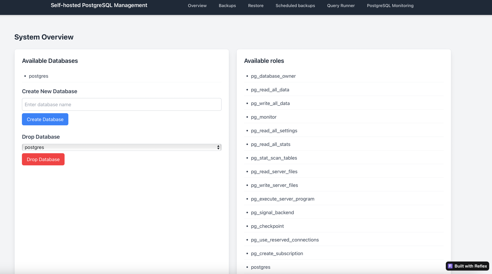

# Self-hosted managed PostgreSQL 

This project provides a self-hosted solution for managing PostgreSQL databases, including backup management, database operations, monitoring, and scheduled backups.

## Features

- Multiple backup types (Full, Incremental, Differential)
- Point-in-time recovery
- Database creation and management
- Scheduled backups
- RESTful API interface
- Web interface
- Grafana dashboard with PostgreSQL metrics

## How to start?

1. Generate certificates
   ```bash
   bash generate-certs.sh
   ```
2. Prepare environment variables (which are mandatory in compose.yml)
3. If you want to run s3 locally - run
    ```bash 
    docker compose  -f compose.s3.yml up --wait
    ```
    Otherwise, set proper address for your s3 storage in ``backup-manager/config/pgbackrest.conf``,  ``postgres/config/postgresql.conf``, then
    For running prometheus and grafana - you should run

   ```bash
    docker compose -f compose.monitoring.yml up
    ```
    You may run it on another host, if you do in such case, set proper address for grafana in .env.
4. 
    Run docker-compose
    ```bash
    docker compose -f compose.yml up
    ```
  
      


## Environment Variables

The following environment variables are required:

```env
# PostgreSQL Configuration
POSTGRES_PASSWORD=postgres     # Password for PostgreSQL
PG_VERSION=16                 # PostgreSQL version

# Backup Configuration
BACKREST_VERSION=2.54.2       # pgBackRest version
BACKREST_UID={your_uid}      # User ID for pgBackRest (use $(id -u))
BACKREST_GID={your_gid}      # Group ID for pgBackRest (use $(id -g))

# Volume Configuration
DOCKER_VOLUME_DIRECTORY=./volume  # Directory for storing backup data

GRAFANA_ADDRESS=http://localhost:3001 # address for grafana 

```

## PostgreSQL Configuration

You can use custom PostgreSQL configuration, for configuring it - edit file ``postgres/pg_hba.conf``,  ``postgres/postgresql.conf``.

## pgBackRest Configuration

By default, pgBackRest configured to save data in local s3 storage (which could be run via running ``docker compose  -f compose.s3.yml up``. 
If you want to access to remote s3 storage, you should modify ``backup-manager/config/pgbackrest.conf``,  ``postgres/config/postgresql.conf`` and set proper address for your s3 storage there and add certificates for your s3 storage. 


## UI interface

For accessing management service via UI interface you should go to `http://0.0.0.0:3000`

### Screenshots




## API Endpoints

Also, you can access to management service via API. The API server runs on `http://0.0.0.0:8000` by default. 

### Health Check
- `GET /ping` - Check if the service is running

### Backup Operations
- `GET /backups` - List all available backups

#### Create Backups
- `POST /backup/full` - Create a full backup
- `POST /backup/incr` - Create an incremental backup
- `POST /backup/diff` - Create a differential backup

### Recovery Operations
- `POST /restore/immediate` - Perform immediate recovery
- `POST /restore/existing` - Recover from existing stanza
- `POST /restore/time?timestamp={unix_timestamp}` - Perform point-in-time recovery

### Database Management
- `POST /database?database_name={name}` - Create a new database
- `DELETE /database?database_name={name}` - Drop a database
- `POST /database/run` - Execute a custom query

### Backup Scheduling
- `GET /schedule` - List all scheduled backups
- `POST /schedule` - Add a new backup schedule
  ```json
  {
    "job_type": "incr",
    "hour": 4,
    "minute": 0
  }
  ```
- `DELETE /schedule/{schedule_id}` - Delete a scheduled backup

### Request Examples

1. Creating a scheduled backup:
```bash
curl -X POST http://0.0.0.0:8000/schedule \
  -H "Content-Type: application/json" \
  -d '{"job_type":"incr","hour":4,"minute":0}'
```

2. Creating a new database:
```bash
curl -X POST "http://0.0.0.0:8000/database?database_name=mydb"
```

3. Performing point-in-time recovery:
```bash
curl -X POST "http://0.0.0.0:8000/restore/time?timestamp=1743344067"
```

